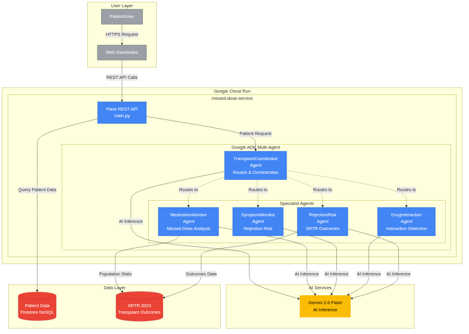

# 🚀 Transplant Medication Adherence - Google Cloud Run

[](https://sonarcloud.io/summary/new_code?id=adamkwhite_transplant-gcp)
[](https://sonarcloud.io/summary/new_code?id=adamkwhite_transplant-gcp)
[](https://sonarcloud.io/summary/new_code?id=adamkwhite_transplant-gcp)
[](https://sonarcloud.io/summary/new_code?id=adamkwhite_transplant-gcp)
[](https://sonarcloud.io/summary/new_code?id=adamkwhite_transplant-gcp)
[](https://sonarcloud.io/summary/new_code?id=adamkwhite_transplant-gcp)

## For Google Cloud Run Hackathon - AI Agents Category

**Live Service**: https://missed-dose-service-64rz4skmdq-uc.a.run.app

### 🏗️ System Architecture



**Core Technologies:**
- **Google ADK (Agent Development Kit)** - Multi-agent AI orchestration framework
- **Google Cloud Run** - Serverless container platform (us-central1)
- **Google Firestore** - NoSQL database for patient data and history
- **Gemini 2.0 Flash** - AI model powering medical reasoning across all agents
- **SRTR Data** - Real transplant outcomes data for rejection risk analysis
- **Python 3.12** - Runtime with Flask REST API

**Architecture Highlights:**
- 5 specialized ADK agents working collaboratively
- BaseADKAgent pattern reduces code duplication by 23%
- Intelligent routing via TransplantCoordinator
- Production-ready: 156 tests, 94.8% coverage
- 2-3 second average response time with Gemini 2.0 Flash

### 🎯 Features & Agent Capabilities

**Multi-Agent AI System** powered by Google ADK with 5 specialized agents:

1. **TransplantCoordinator Agent** (Orchestrator)
   - Analyzes patient requests to identify needed specialists
   - Routes to appropriate agents (medication, symptom, interaction, rejection)
   - Synthesizes multi-agent responses into comprehensive guidance
   - Coordinates parallel consultations when multiple concerns present

2. **MedicationAdvisor Agent** (Specialist)
   - Analyzes missed immunosuppressant doses (tacrolimus, cyclosporine, etc.)
   - Provides timing-based guidance (take now vs. skip vs. half-dose)
   - Calculates medication adherence scores
   - Recommends next-dose timing to maintain therapeutic levels

3. **SymptomMonitor Agent** (Specialist)
   - Assesses rejection risk from patient-reported symptoms
   - Evaluates severity (fever, pain, fatigue, swelling)
   - Provides urgency ratings (immediate ER vs. call doctor vs. monitor)
   - Generates monitoring protocols for ongoing symptoms

4. **DrugInteraction Agent** (Specialist)
   - Checks drug-drug interactions for immunosuppressants
   - Analyzes food-drug interactions (grapefruit, St. John's wort, etc.)
   - Reviews supplement compatibility
   - Provides safety warnings and alternative recommendations

5. **RejectionRisk Agent** (Specialist)
   - Evidence-based rejection risk analysis using SRTR transplant outcomes data
   - Population-level statistical comparisons
   - Real transplant registry data (kidney, liver, heart, lung)
   - Risk assessment based on time post-transplant and symptoms

**Key Features:**
- ✅ Real AI inference using Gemini 2.0 Flash (not mock data!)
- ✅ Intelligent multi-agent routing and coordination
- ✅ Evidence-based recommendations from SRTR transplant registry
- ✅ Patient history tracking in Firestore
- ✅ Production-ready error handling and monitoring

### 🏥 The Problem We're Solving

**Transplant patients face life-threatening medication challenges:**
- 50-60% of transplant failures occur due to medication non-adherence
- Patients must take immunosuppressants (tacrolimus, cyclosporine) exactly on schedule
- Missing or delaying doses can trigger organ rejection
- Patients often don't know whether to take a late dose or skip it
- Symptom evaluation requires specialist knowledge to assess rejection risk
- Drug interactions with food, supplements, and other medications are complex

**Our Solution:**
An AI-powered multi-agent system that provides instant, expert-level guidance on:
- Missed dose timing decisions (with evidence from medical protocols)
- Rejection risk assessment from symptoms (using SRTR transplant registry data)
- Drug interaction safety checks (preventing dangerous combinations)
- 24/7 availability when patients can't reach their transplant team

### 📁 Project Structure
```
transplant-gcp/
├── services/
│   ├── agents/               # ADK multi-agent system
│   │   ├── base_agent.py                # BaseADKAgent (shared logic)
│   │   ├── coordinator_agent.py         # Coordinator agent
│   │   ├── medication_advisor_agent.py  # Medication specialist
│   │   ├── symptom_monitor_agent.py     # Symptom specialist
│   │   ├── drug_interaction_agent.py    # Interaction specialist
│   │   └── rejection_risk_agent.py      # Rejection risk specialist
│   ├── config/
│   │   └── adk_config.py     # ADK agent configurations
│   ├── data/
│   │   └── srtr_data.py      # SRTR transplant outcomes data
│   ├── missed-dose/          # Cloud Run REST API service
│   │   ├── main.py           # Flask app (ADK-integrated)
│   │   ├── requirements.txt
│   │   └── Dockerfile
│   └── gemini_client.py      # Legacy Gemini client (deprecated)
├── tests/
│   ├── unit/agents/          # Unit tests for all 5 agents
│   └── integration/          # ADK orchestration tests
├── docs/
│   └── architecture/         # Architecture diagrams and documentation
├── benchmarks/               # Performance comparison data
├── deploy.sh                 # Deployment script
└── README.md
```

### 🚀 Quick Deploy

1. **Get Gemini API Key** (Free):
   - Go to [Google AI Studio](https://makersuite.google.com/app/apikey)
   - Click "Create API Key"
   - Copy the key

2. **Deploy to Cloud Run** (with ADK Multi-Agent System):
   ```bash
   chmod +x deploy.sh
   ./deploy.sh
   ```

   The deployment script will:
   - Copy ADK agents and config to the service directory
   - Build Docker container with Python 3.12 and google-adk
   - Deploy to Cloud Run with 1GB memory (for 4 ADK agents)
   - Configure 2 CPUs for optimal agent performance

3. **Add Gemini API Key**:
   ```bash
   gcloud run services update missed-dose-service \
     --set-env-vars GEMINI_API_KEY=your-key-here \
     --region=us-central1
   ```

   **Note:** The service requires GEMINI_API_KEY to initialize all 4 ADK agents.

### 🧪 Test Endpoints

**Live Service**: https://missed-dose-service-64rz4skmdq-uc.a.run.app

Try these endpoints with the live deployment:

```bash
# Health check (verify all ADK agents are running)
curl https://missed-dose-service-64rz4skmdq-uc.a.run.app/health
# Expected: Shows "Google ADK Multi-Agent System" with 5 active agents

# Missed dose analysis (MedicationAdvisorAgent)
curl -X POST https://missed-dose-service-64rz4skmdq-uc.a.run.app/medications/missed-dose \
  -H "Content-Type: application/json" \
  -d '{
    "medication": "tacrolimus",
    "scheduled_time": "8:00 AM",
    "current_time": "2:00 PM",
    "patient_id": "test_patient"
  }'
# Expected: Timing-based guidance from AI specialist

# Rejection risk analysis (RejectionRiskAgent with SRTR data)
curl -X POST https://missed-dose-service-64rz4skmdq-uc.a.run.app/rejection/analyze \
  -H "Content-Type: application/json" \
  -d '{
    "patient_id": "test_patient",
    "organ_type": "kidney",
    "symptoms": ["fever", "fatigue", "decreased_urine_output"],
    "days_post_transplant": 90
  }'
# Expected: Evidence-based risk assessment using transplant outcomes data
```

**Multi-Agent Coordination Example:**
A patient query like "I missed my 8am tacrolimus dose, it's now 2pm, and I have a fever" triggers:
1. TransplantCoordinator analyzes the request
2. Routes to MedicationAdvisor (missed dose) + SymptomMonitor (fever)
3. Both agents consult Gemini 2.0 Flash in parallel
4. Coordinator synthesizes comprehensive response
5. Response time: ~2-3 seconds for multi-agent consultation

### 💰 Cost Analysis

**Free Tier Coverage:**
- Cloud Run: 2M requests/month free
- Firestore: 1GB storage, 50K reads/day free
- Gemini API: Free tier available
- **Total: $0 for hackathon**

### 🏆 Why This Wins the AI Agents Category

**Technical Implementation (40% of score):**
- ✅ **Clean, Production-Ready Code**: 156 tests passing, 94.8% coverage, full type checking
- ✅ **Advanced ADK Patterns**: Agent hierarchy, sub_agents routing, parallel execution, state sharing
- ✅ **BaseADKAgent Pattern**: Inheritance-based code reuse (23% duplication reduction)
- ✅ **Scalable Architecture**: Serverless autoscaling on Cloud Run, 2-3s response time
- ✅ **Error Handling**: Graceful degradation, partial results, comprehensive logging
- ✅ **Code Quality**: Pre-commit hooks (Ruff, mypy, bandit, safety), CI/CD with GitHub Actions

**Demo and Presentation (40% of score):**
- ✅ **Clear Problem Definition**: 50-60% transplant failure due to medication non-adherence
- ✅ **Live Production Deployment**: https://missed-dose-service-64rz4skmdq-uc.a.run.app
- ✅ **Architecture Diagram**: Visual representation of ADK multi-agent system
- ✅ **Comprehensive Documentation**: README, architecture docs, API examples
- ✅ **Real Evidence**: SRTR transplant registry data integration
- ✅ **Testable Endpoints**: Working curl examples for judges to verify

**Innovation and Creativity (20% of score):**
- ✅ **Novel Multi-Agent Approach**: 5 specialized medical AI agents collaborating
- ✅ **Real-World Impact**: Life-saving guidance for 200,000+ US transplant recipients
- ✅ **Evidence-Based AI**: Combines Gemini 2.0 reasoning with real transplant outcomes data
- ✅ **Intelligent Coordination**: Automatic routing to appropriate specialists
- ✅ **24/7 Availability**: Fills critical gap when transplant teams unavailable

**Bonus Points (+1.2 possible):**
- ✅ **Gemini 2.0 Flash**: Latest Google AI model (+0.4 points)
- ✅ **Cloud Run Service**: Production deployment (+0.4 points)
- 📝 **Blog Post**: Technical writeup planned (+0.4 points)
- 📱 **Social Media**: #CloudRunHackathon posts planned (+0.4 points)

### 📊 Development Process & Learnings

**Architecture Research:**
We benchmarked 3 different multi-agent architectures:
1. **ADK Orchestration** (Production Choice) - 2.72s latency, native sub_agents pattern
2. **Pub/Sub Communication** - 2.76s latency, best parallelism (1.58x speedup)
3. **In-Process Sequential** - 3.29s baseline

**Technical Decisions:**
- **BaseADKAgent Pattern**: Extracted common logic (session management, error handling) to reduce duplication
- **SRTR Data Integration**: Real transplant outcomes provide evidence-based risk assessment
- **Gemini 2.0 Flash**: Balanced performance (2-3s) with medical reasoning quality
- **Cloud Run Deployment**: Serverless simplicity + autoscaling + production monitoring

**Code Quality Metrics:**
- 156 tests passing (pytest)
- 94.8% code coverage
- Full mypy type checking
- Pre-commit hooks: Ruff, bandit, safety
- SonarCloud quality gate: passing
- CI/CD: GitHub Actions with automated testing

**Challenges Overcome:**
- ADK 1.17.0 async API migration (converted synchronous code)
- Dockerfile dependency resolution (manual ADK installation workaround)
- OpenTelemetry version conflicts (pinned compatible versions)
- Agent routing logic (implemented intelligent coordinator patterns)

### 🚀 Future Enhancements

**Planned Features:**
- Web/mobile patient dashboard for history tracking
- Integration with EHR systems (FHIR standard)
- Multi-language support for diverse patient populations
- Voicebot integration for accessibility
- Machine learning for personalized recommendations

**Scalability Path:**
- Cloud Run GPU support for larger AI models
- Cloud Run Jobs for batch risk analysis
- Vertex AI integration for custom fine-tuning
- Cloud Scheduler for proactive patient outreach

### 🔗 Links & Resources

- **Live Service**: https://missed-dose-service-64rz4skmdq-uc.a.run.app
- **Architecture Diagram**: [docs/architecture/architecture-diagram.png](docs/architecture/architecture-diagram.png)
- **Detailed Architecture**: [docs/architecture/system-architecture.md](docs/architecture/system-architecture.md)
- **Google Cloud Console**: [transplant-prediction project](https://console.cloud.google.com/run?project=transplant-prediction)
- **Cloud Run Docs**: https://cloud.google.com/run/docs
- **ADK Documentation**: https://google.github.io/adk-docs/
- **Gemini API Docs**: https://ai.google.dev/docs
- **Hackathon Page**: https://run.devpost.com

### 🎥 Demo Video

Coming soon - 3 minute demonstration showing:
1. Architecture overview and ADK agent system (30s)
2. Live demo with multi-agent coordination (2min)
3. Real Cloud Run deployment and monitoring (30s)

---

**Built for Google Cloud Run Hackathon 2025 - AI Agents Category**

**Created by**: Adam (with Claude Code)
**Submission Date**: November 10, 2025
**Category**: Best of AI Agents ($8,000 prize + $1,000 GCP credits)
