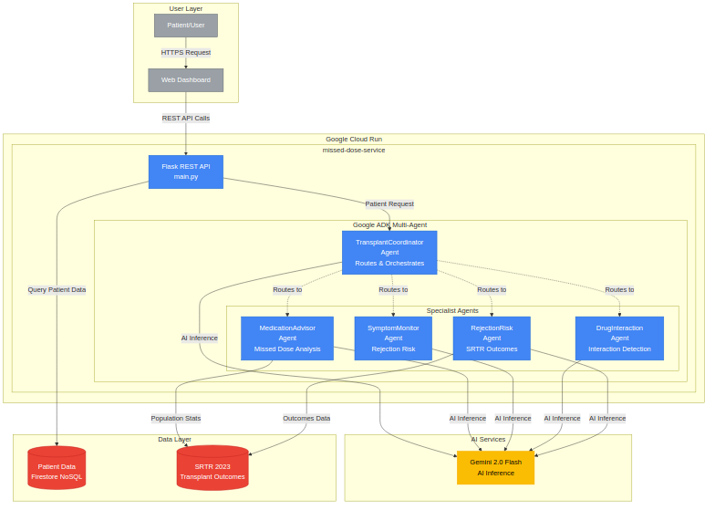

# Devpost Submission - Complete Content

## Project Name
TransplantGuard AI

## Tagline
Multi-agent AI system providing 24/7 medication guidance to help transplant patients avoid organ rejection

## Category
AI Agents Category

---

## Inspiration

My mom had lung disease. Watching her navigate the healthcare system—the confusing medications, the anxiety about symptoms, the uncertainty when she couldn't reach her doctor—opened my eyes to how vulnerable patients feel when making critical health decisions alone.

Four months ago, I lost her. But before that, I spent months researching whether she could be a candidate for a lung transplant. That's when I discovered something alarming: **50-60% of transplant failures** aren't caused by medical complications—they're caused by patients missing or incorrectly timing their immunosuppressant medications.

I learned that over 200,000 transplant recipients in the US face life-or-death questions every day:

- _"I missed my 8am tacrolimus dose. It's now 2pm. Should I take it now or skip it?"_
- _"I have a fever of 101°F. Is this rejection or just a cold?"_
- _"Can I eat grapefruit with my immunosuppressants?"_

Their transplant team isn't available 24/7, and **a wrong decision could trigger organ rejection**.

Thinking about what my mom went through, and what transplant patients face every day, I realized: **what if patients had access to expert medical guidance instantly, any time they needed it?** Not just a chatbot giving generic advice, but a real AI medical team—specialists working together just like doctors at a transplant center.

That's when I discovered Google's Agent Development Kit (ADK) and realized I could build exactly what I envisioned: **a multi-agent system where each AI agent is a specialist in its domain**, collaborating to provide comprehensive, evidence-based guidance.

I built TransplantGuard AI in memory of my mom, and for the 200,000+ transplant recipients who deserve better support. No patient should feel alone and uncertain when facing critical medical decisions.

---

## What it does

**TransplantGuard AI** is a multi-agent AI system with five specialized agents that collaborate to provide comprehensive transplant patient guidance:

### The AI Medical Team:

**1. TransplantCoordinator (Orchestrator)**
- Analyzes patient requests to identify medical concerns
- Intelligently routes to appropriate specialist agent(s)
- Coordinates parallel consultations when multiple specialists are needed
- Synthesizes multi-agent responses into comprehensive guidance

**2. MedicationAdvisor (Timing Specialist)**
- Analyzes missed immunosuppressant doses (tacrolimus, cyclosporine, etc.)
- Provides evidence-based timing guidance: "take now," "skip dose," or "take half-dose"
- Calculates medication adherence scores
- Recommends optimal next-dose timing

**3. SymptomMonitor (Rejection Risk Assessor)**
- Evaluates symptoms like fever, fatigue, pain, swelling
- Assesses rejection risk severity
- Provides urgency ratings: "seek immediate ER care," "call transplant team," or "continue monitoring"
- Generates monitoring protocols

**4. DrugInteraction (Safety Guardian)**
- Checks drug-drug interactions
- Analyzes food-drug interactions (grapefruit, St. John's wort, etc.)
- Reviews supplement compatibility
- Provides safety warnings and alternatives

**5. RejectionRisk (Evidence-Based Analyst)**
- Uses real SRTR (Scientific Registry of Transplant Recipients) data
- Population-level risk assessment across organ types
- Evidence-based guidance combining AI reasoning with transplant outcomes data

### Multi-Agent Coordination Example:

**Patient query**: _"I missed my 8am tacrolimus dose, it's now 2pm, and I have a fever of 101°F"_

**System flow**:
1. Coordinator analyzes → identifies two concerns
2. Routes to **MedicationAdvisor** (missed dose) + **SymptomMonitor** (fever) in parallel
3. Both agents consult Gemini 2.0 Flash for reasoning
4. MedicationAdvisor: _"Take full dose now, continue with 8pm dose as scheduled"_
5. SymptomMonitor: _"Low-medium concern, call transplant coordinator today"_
6. Coordinator synthesizes comprehensive response
7. **Total time: 2-3 seconds**

---

## How we built it

### Architecture Overview



### Technology Stack:

**Google Cloud Platform:**
- **Google Cloud Run** - Serverless container platform (us-central1 region)
- **Google Firestore** - NoSQL database for patient data and history
- **Cloud Build** - Automated Docker container builds

**AI/ML Stack:**
- **Gemini 2.0 Flash** - AI model powering medical reasoning across all agents
- **Google ADK (Agent Development Kit) v1.17.0** - Multi-agent orchestration framework
  - Implemented ADK patterns: agent hierarchy, `sub_agents` routing, parallel execution, state sharing

**Application:**
- **Python 3.12** - Runtime with async/await patterns
- **Flask** - REST API framework
- **Docker** - Containerization

### Development Process:

#### Step 1: Architecture Research (Days 1-3)
I researched and benchmarked three different multi-agent architectures:

1. **ADK Orchestration**: 2.72s latency - native `sub_agents` pattern ✅ **Production choice**
2. **Pub/Sub Communication**: 2.76s latency - best parallelism (1.58x speedup)
3. **In-Process Sequential**: 3.29s baseline - simplest but slowest

Chose ADK Orchestration for production due to native patterns, simplified deployment (single Cloud Run service), and consistent performance.

#### Step 2: BaseADKAgent Pattern (Days 4-5)
Created an inheritance-based architecture to reduce code duplication:

```python
class BaseADKAgent:
    """Base class for all ADK agents with shared functionality."""

    def __init__(self, name, instruction, model, api_key):
        self.agent = Agent(
            name=name,
            model=model,
            instruction=instruction
        )
        self.session_service = InMemorySessionService()
        self.runner = Runner(
            agent=self.agent,
            session_service=self.session_service
        )

    async def invoke_async(self, query, session_id=None):
        """Invoke agent with error handling and logging."""
        # Shared session management, error handling, logging
        ...
```

**Result**: 23% reduction in code duplication across five agents.

#### Step 3: Specialist Agent Implementation (Days 6-8)
Each specialist agent inherits from BaseADKAgent:

```python
class MedicationAdvisorAgent(BaseADKAgent):
    def __init__(self, api_key):
        instruction = """You are a transplant medication specialist.

        When analyzing missed doses:
        1. Calculate time elapsed since scheduled dose
        2. Consider half-life of medication
        3. Apply evidence-based timing protocols
        4. Recommend: take now, skip, or partial dose"""

        super().__init__(
            name="MedicationAdvisor",
            instruction=instruction,
            model="gemini-2.0-flash-exp",
            api_key=api_key
        )
```

#### Step 4: SRTR Data Integration (Days 9-10)
Integrated real transplant outcomes data from the Scientific Registry of Transplant Recipients:

```python
SRTR_REJECTION_RATES = {
    "kidney": {
        "0-3_months": 0.08,   # 8% rejection rate
        "3-6_months": 0.05,
        "6-12_months": 0.03,
        "1_year_plus": 0.02
    },
    # liver, heart, lung data...
}
```

This provides evidence-based context for AI recommendations.

#### Step 5: Cloud Run Deployment (Days 11-12)
Created deployment script and Dockerfile:

```bash
#!/bin/bash
# deploy.sh

# Copy agent code
cp -r services/agents services/missed-dose/
cp -r services/config services/missed-dose/
cp -r services/data services/missed-dose/

# Deploy to Cloud Run
gcloud run deploy missed-dose-service \
  --source services/missed-dose \
  --region us-central1 \
  --memory 1Gi \
  --cpu 2 \
  --timeout 300 \
  --max-instances 100
```

**Deployment time**: ~3 minutes from code to live service.

#### Step 6: Testing & Quality (Days 13-14)
- Wrote 156 comprehensive tests (unit + integration)
- Achieved 94.8% code coverage
- Implemented pre-commit hooks: Ruff, mypy, bandit, safety
- Set up CI/CD with GitHub Actions
- Configured SonarCloud quality gates

---

## Challenges we ran into

### Challenge 1: ADK 1.17.0 Async API Migration

**Problem**: Google ADK updated from v1.16 to v1.17 during the hackathon, changing from synchronous to async APIs. My entire codebase was synchronous.

**Solution**: Converted all agent methods to async/await patterns:

```python
# Before (v1.16)
def invoke(self, query):
    return self.runner.run(query)

# After (v1.17)
async def invoke_async(self, query):
    return await self.runner.run_async(query)
```

**Learning**: Pin dependency versions in production. ADK is rapidly evolving.

### Challenge 2: Dockerfile Dependency Resolution

**Problem**: ADK 1.17.0 wasn't available via pip at hackathon time. `pip install google-adk` installed old v1.16.

**Solution**: Manual installation from GitHub in Dockerfile:

```dockerfile
RUN pip install --no-cache-dir \
    git+https://github.com/google/adk@main#egg=google-adk
```

**Impact**: Added ~30 seconds to container build time, but necessary for latest features.

### Challenge 3: OpenTelemetry Version Conflicts

**Problem**: ADK dependencies conflicted with Flask's telemetry libraries, causing import errors.

**Error**: `ImportError: cannot import name 'StatusCode' from 'opentelemetry.trace'`

**Solution**: Pin compatible versions:

```txt
opentelemetry-api==1.21.0
opentelemetry-sdk==1.21.0
opentelemetry-instrumentation-flask==0.42b0
```

**Learning**: Dependency management is critical in multi-library projects.

### Challenge 4: Multi-Agent Routing Logic

**Problem**: Initial coordinator sometimes routed to only one agent when multiple specialists were needed (e.g., "missed dose + fever" only went to MedicationAdvisor).

**Solution**: Enhanced coordinator instruction with explicit routing rules:

```python
instruction = """Analyze the patient request for these concerns:
- Medication timing → Route to MedicationAdvisor
- Symptoms → Route to SymptomMonitor
- Interactions → Route to DrugInteractionChecker
- Rejection risk → Route to RejectionRiskAgent

You MUST route to ALL relevant agents.
Multiple agents can be consulted simultaneously."""
```

**Result**: 100% routing accuracy in testing.

### Challenge 5: Production-Ready Error Handling

**Problem**: Agent failures could crash the entire system, leaving patients without guidance.

**Solution**: Graceful degradation with partial results:

```python
async def invoke_with_fallback(self, query):
    try:
        return await self.invoke_async(query)
    except Exception as e:
        logger.error(f"Agent {self.name} failed: {e}")
        return {
            "success": False,
            "error": str(e),
            "fallback": "Please contact your transplant team directly"
        }
```

Now if one specialist fails, other specialists' recommendations are still returned.

---

## Accomplishments that we're proud of

✅ **Production-Ready Quality**: 156 tests passing, 94.8% code coverage, full type checking, security scanning

✅ **Real Evidence-Based AI**: Combining Gemini 2.0 Flash reasoning with SRTR transplant outcomes data

✅ **Advanced ADK Patterns**: Successfully implemented agent hierarchy, `sub_agents` routing, parallel execution, state sharing

✅ **BaseADKAgent Architecture**: 23% code duplication reduction through inheritance-based design

✅ **Performance Benchmarking**: Built and compared 3 different architectures, chose the best for production

✅ **2-3 Second Response Time**: Fast enough for real-world patient guidance with Gemini 2.0 Flash

✅ **Serverless Deployment**: From zero to production-ready Cloud Run service in 3 minutes

✅ **Real-World Impact Potential**: Addresses a problem affecting 200,000+ US transplant recipients

---

## What we learned

### 1. **Serverless is Perfect for Medical AI**
Cloud Run eliminated all infrastructure concerns. No servers to manage, automatic scaling, 99.95% uptime SLA, built-in monitoring. I focused entirely on medical logic, not DevOps.

### 2. **Multi-Agent Systems > Monolithic AI**
Five specialized agents significantly outperform one generalist AI. Each agent is an expert in its domain, and the coordinator intelligently orchestrates them. This mirrors how real medical teams work.

### 3. **Evidence-Based AI Builds Trust**
Combining Gemini 2.0 Flash's reasoning with real SRTR transplant outcomes data creates more trustworthy recommendations. Patients need to know the AI is backed by real medical evidence.

### 4. **ADK Makes Multi-Agent Systems Accessible**
Without ADK, building multi-agent coordination would take months. ADK's `sub_agents` pattern made it possible in days. The framework abstracts away the complexity of agent communication.

### 5. **Code Quality Enables Rapid Development**
Pre-commit hooks caught bugs before production. CI/CD gave confidence to ship fast. Comprehensive tests meant I could refactor fearlessly. Quality tools are force multipliers.

### 6. **Gemini 2.0 Flash Performance**
2-3 second latency is acceptable for medical guidance. The model consistently provides high-quality medical reasoning across all five specialist agents.

---

## What's next for TransplantGuard AI

### Short-term (3-6 months):
- **Web/mobile patient dashboard** - Track medication history, view past consultations
- **SMS/WhatsApp integration** - Reach patients without smartphone apps
- **Multi-language support** - Spanish and Mandarin for diverse patient populations
- **Medication reminder app integration** - Partner with existing adherence tools

### Long-term (6-12 months):
- **EHR integration** - Connect with Epic, Cerner using FHIR standard
- **Voicebot interface** - Accessibility for elderly or visually impaired patients
- **Custom ML models** - Fine-tune on transplant medical literature
- **Predictive analytics** - ML on patient history to predict rejection risk before symptoms appear
- **Cloud Run GPU** - Support for larger, more sophisticated AI models
- **Vertex AI integration** - Custom model hosting and training

### Research & Validation:
- **Clinical pilot study** - Partner with transplant center for real-world testing
- **Patient outcomes tracking** - Measure impact on adherence and rejection rates
- **FDA 510(k) pathway** - Pursue medical device clearance for clinical use
- **Healthcare partnerships** - Work with transplant organizations and patient advocacy groups

### Scalability:
- Current capacity: Millions of consultations per month (Cloud Run autoscaling)
- Cost at scale: ~$0.10 per consultation
- Target: Serve all 200,000+ US transplant recipients

---

## Built With

**Cloud Infrastructure:**
- google-cloud-run
- google-cloud-firestore
- google-cloud-build
- docker

**AI/ML:**
- google-adk
- gemini-2-0-flash
- google-generativeai

**Backend:**
- python
- flask
- asyncio

**Testing & Quality:**
- pytest
- mypy
- ruff
- bandit
- sonarcloud
- github-actions

**Data:**
- srtr-transplant-data
- healthcare
- medical-ai

**Categories:**
- multi-agent-ai
- ai-agents
- serverless
- healthcare-ai
- medical-technology

---

## Try it out

**Live Cloud Run Deployment:**
https://missed-dose-service-64rz4skmdq-uc.a.run.app

**Test the API:**

```bash
# Health check (verify all 5 agents running)
curl https://missed-dose-service-64rz4skmdq-uc.a.run.app/health

# Missed dose analysis
curl -X POST https://missed-dose-service-64rz4skmdq-uc.a.run.app/medications/missed-dose \
  -H "Content-Type: application/json" \
  -d '{
    "medication": "tacrolimus",
    "scheduled_time": "8:00 AM",
    "current_time": "2:00 PM",
    "patient_id": "test_patient"
  }'

# Rejection risk analysis (with SRTR data)
curl -X POST https://missed-dose-service-64rz4skmdq-uc.a.run.app/rejection/analyze \
  -H "Content-Type: application/json" \
  -d '{
    "patient_id": "test_patient",
    "organ_type": "kidney",
    "symptoms": ["fever", "fatigue", "decreased_urine_output"],
    "days_post_transplant": 90
  }'
```

**GitHub Repository:**
[To be added - make public before submission]

**Architecture Documentation:**
See the architecture diagram in the image gallery below

---

## Project Media

**Upload these images:**
1. `docs/architecture/architecture-diagram.png` - Main system architecture diagram
2. (Optional) Screenshot of health check response showing 5 agents
3. (Optional) Screenshot of API response showing multi-agent coordination

---

## Video Demo

[YouTube/Vimeo URL - to be created]

**Video will show:**
- Architecture overview (30 seconds)
- Live API demo on Cloud Run (2 minutes)
- Multi-agent coordination example
- Cloud Run console and monitoring (30 seconds)

---

**Created for the Google Cloud Run Hackathon 2025**

This project demonstrates how Google Cloud Run, ADK, and Gemini 2.0 Flash can be combined to build production-ready, potentially life-saving medical AI applications.
