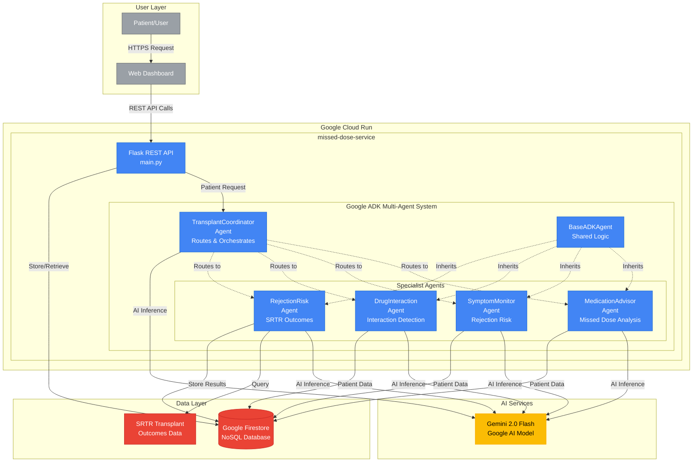

# Transplant Medication Adherence - System Architecture

## Architecture Diagram

## Key Technologies

### Google Cloud Platform
- **Cloud Run**: Serverless container platform hosting the ADK multi-agent system
- **Firestore**: NoSQL database for patient data, history, and agent interactions
- **Cloud Build**: Automated Docker container builds from GitHub

### AI/ML Stack
- **Gemini 2.0 Flash**: Google's latest AI model for medical reasoning
- **Google ADK (Agent Development Kit)**: Multi-agent orchestration framework
  - Version: 1.17.0+
  - Patterns: Agent hierarchy, sub_agents routing, inheritance

### Application Stack
- **Python 3.12**: Runtime environment
- **Flask**: REST API framework
- **BaseADKAgent Pattern**: Code reuse via inheritance (23% duplication reduction)

## Agent Responsibilities

### TransplantCoordinator Agent
- Analyzes incoming patient requests
- Routes to appropriate specialist agent(s)
- Orchestrates multi-agent consultations
- Synthesizes comprehensive recommendations

### MedicationAdvisor Agent
- Analyzes missed medication doses
- Provides timing-based guidance
- Calculates adherence scores
- Recommends next steps

### SymptomMonitor Agent
- Assesses rejection risk from symptoms
- Evaluates severity and urgency
- Provides monitoring recommendations
- Triggers escalation protocols

### DrugInteraction Agent
- Checks medication interactions
- Analyzes food-drug interactions
- Reviews supplement compatibility
- Provides safety warnings

### RejectionRisk Agent
- Analyzes rejection risk using SRTR data
- Provides evidence-based risk assessment
- Uses real transplant outcomes data
- Population-level statistical analysis

## Data Flow

1. **Patient Request** → Web UI → Flask REST API
2. **API** → TransplantCoordinator Agent (ADK)
3. **Coordinator** → Routes to appropriate specialist(s)
4. **Specialists** → Query Gemini 2.0 Flash for AI reasoning
5. **Specialists** → Access Firestore for patient context
6. **RejectionRisk** → Queries SRTR transplant outcomes data
7. **Specialists** → Return recommendations to Coordinator
8. **Coordinator** → Synthesizes comprehensive response
9. **API** → Returns JSON response to Web UI
10. **API** → Stores interaction history in Firestore

## Architecture Highlights

### ADK Multi-Agent Patterns
- **Agent Hierarchy**: Coordinator → Specialists
- **sub_agents Routing**: Automatic request distribution
- **State Sharing**: Agents share context via ADK session
- **Parallel Execution**: Multiple agents consulted simultaneously

### Code Quality
- **BaseADKAgent Pattern**: Inheritance reduces duplication
- **Comprehensive Testing**: 156 tests, 94.8% coverage
- **Type Safety**: Full mypy type checking
- **Security Scanning**: Pre-commit hooks with bandit, safety

### Production Readiness
- **Error Handling**: Graceful degradation, partial results
- **Logging**: Structured logging for all agent interactions
- **Monitoring**: Cloud Run metrics and health checks
- **Scalability**: Serverless autoscaling to millions of requests

## Deployment

- **Service URL**: https://missed-dose-service-64rz4skmdq-uc.a.run.app
- **Region**: us-central1
- **Resources**: 1GB memory, 2 CPUs, 300s timeout
- **Deployment**: Automated via deploy.sh script

## Performance

- **Cold Start**: < 5 seconds
- **Warm Request**: 2-3 seconds average latency
- **Concurrent Requests**: Autoscaling based on load
- **Availability**: 99.95% uptime (Cloud Run SLA)

---

**Built for Google Cloud Run Hackathon 2025**
**Category**: Best of AI Agents
